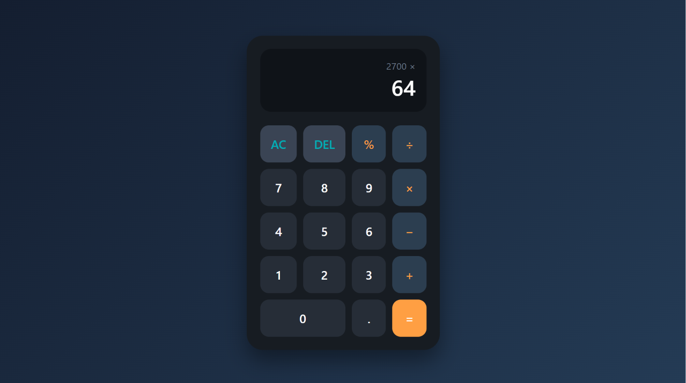

# 🧮 Calculator

A responsive calculator built with HTML, CSS, and JavaScript. It features a clean, modern interface and supports basic arithmetic operations with real-time display updates.

---

## ✨ Features

* Perform basic arithmetic operations:

  * Addition (+)
  * Subtraction (−)
  * Multiplication (×)
  * Division (÷)
  * Modulus (%)
* Real-time display updates
* Clear (AC) and Delete (DEL) functionality
* Responsive design for desktop and mobile devices
* Modern and user-friendly interface

---

## 🛠️ Tech Stack

* **HTML5** – Semantic page structure
* **CSS3** – CSS Grid, Flexbox, transitions, and responsive design
* **JavaScript (Vanilla)** – DOM manipulation, event handling, and calculator logic

---

## 📷 Preview

### 🖥️ Calculator Interface

  

---

## 🚀 Live Demo

🔗 **[View Live Demo](https://bytebymaria.github.io/codealpha_tasks/calculator/)**

---

## 📚 What I Learned

Building this calculator helped me strengthen my understanding of:

* Manipulating the DOM with JavaScript
* Handling user interactions through event-driven programming
* Implementing arithmetic operations using JavaScript
* Managing application state and updating the UI dynamically
* Creating responsive layouts with CSS Grid and Flexbox
* Structuring a frontend project using HTML, CSS, and JavaScript

---

## 👩‍💻 Author

**Maria Khalid**

- GitHub: [@bytebymaria](https://github.com/bytebymaria)
- LinkedIn: [Maria Khalid](www.linkedin.com/in/maria-khalid2706)

---

⭐ If you enjoyed this project, consider giving it a star!
