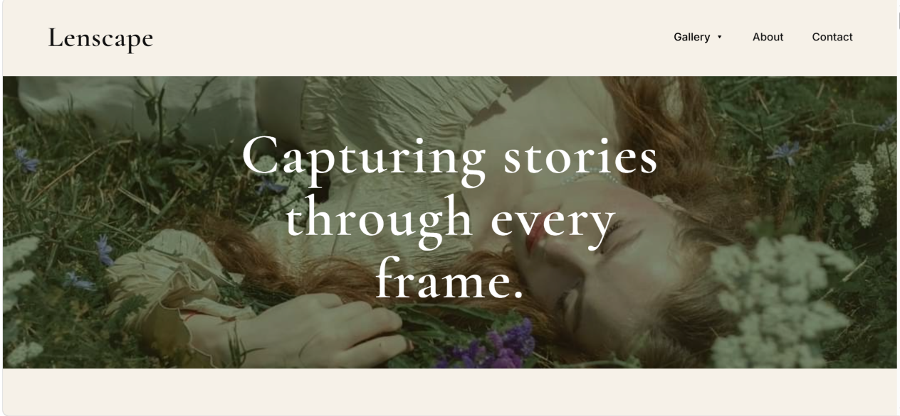
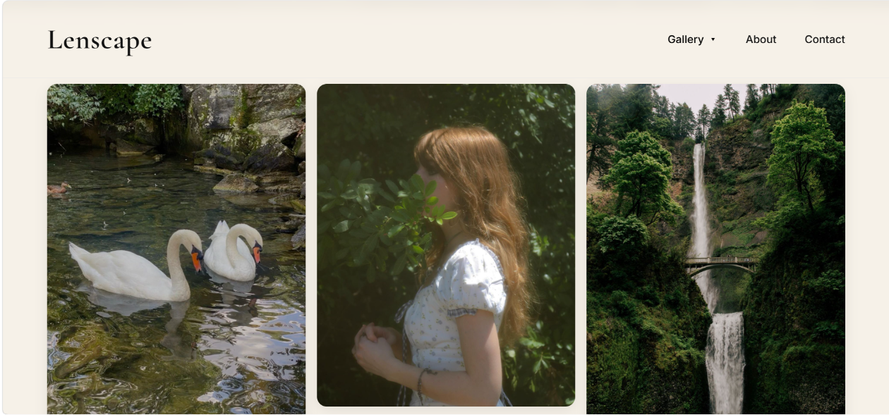
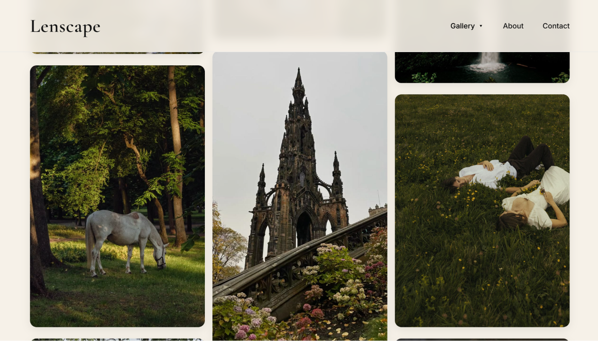
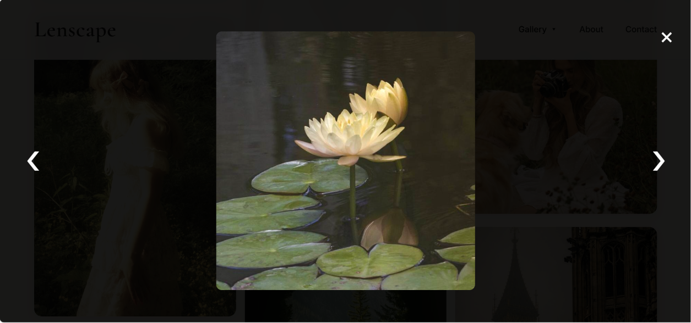
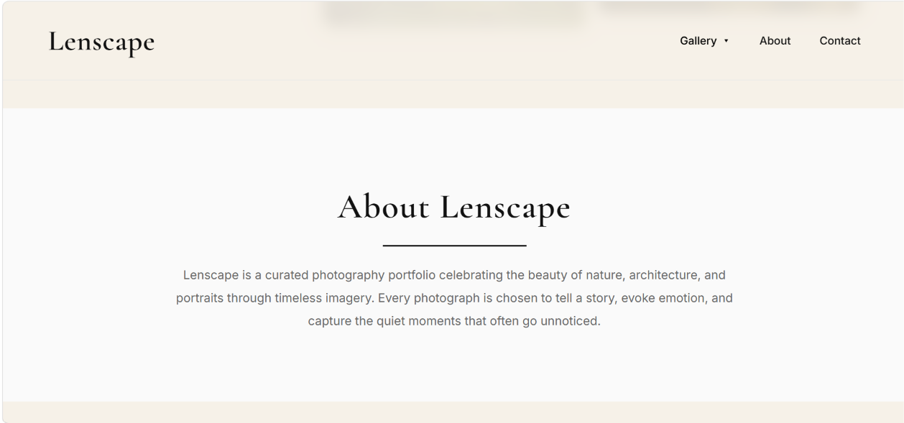
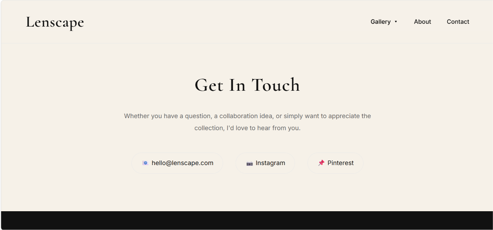
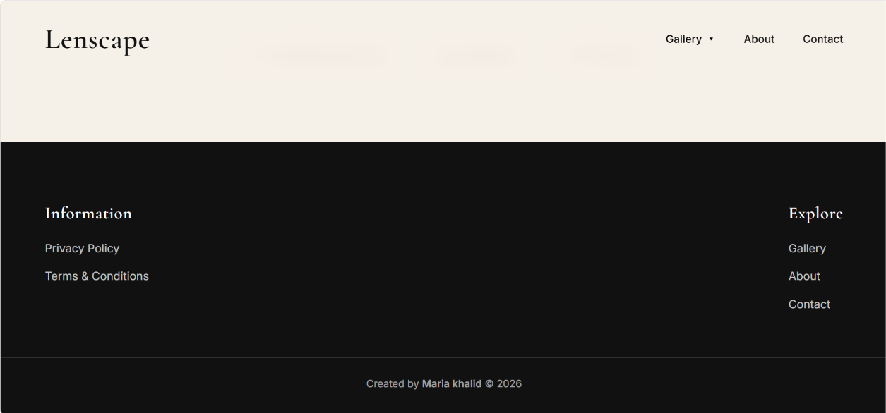

# 📸 Lenscape – Image Gallery

A responsive photography portfolio website built with HTML, CSS, and JavaScript. Lenscape features a clean, editorial-inspired interface that showcases nature, architecture, and portrait photography through category filtering, a masonry-style gallery, and an interactive lightbox experience.

---

## ✨ Features

- Responsive layout for desktop, tablet, and mobile devices
- Masonry-style gallery built with CSS Columns
- Category-based image filtering
- Interactive lightbox with previous and next navigation
- Keyboard support (Arrow Keys & Escape)
- Smooth hover animations and transitions
- Sticky navigation bar with a dropdown filter
- Clean, minimalist editorial-inspired design

---

## 🛠️ Tech Stack

- **HTML5** – Semantic page structure
- **CSS3** – Flexbox, CSS Columns, Media Queries, CSS Variables, and animations
- **JavaScript (Vanilla)** – DOM manipulation, event handling, filtering, and lightbox functionality
- **Google Fonts** – Cormorant Garamond & Inter

---

## 📷 Preview

<h3 align="center">Hero Section</h3>

  

<h3 align="center">Gallery</h3>

  

  

<h3 align="center">Interactive Lightbox</h3>

  

<h3 align="center">About Section</h3>

  

<h3 align="center">Get in Touch</h3>

  

<h3 align="center">Footer</h3>

  

---

## 🚀 Live Demo

🔗 **[View Live Demo](https://bytebymaria.github.io/codealpha_tasks/image-gallery/)**

---

## 📚 What I Learned

Building Lenscape helped me strengthen my understanding of:

- Writing semantic and accessible HTML
- Creating responsive layouts with CSS Columns, Flexbox, and Media Queries
- Using JavaScript for DOM manipulation and event handling
- Building interactive UI components such as image filtering and a lightbox
- Designing clean, user-friendly interfaces with smooth animations
- Organizing a frontend project for deployment and version control with Git & GitHub

---

## 👩‍💻 Author

**Maria Khalid**

- GitHub: [@bytebymaria](https://github.com/bytebymaria)
- LinkedIn: [Maria Khalid](www.linkedin.com/in/maria-khalid2706)

---

⭐ If you enjoyed this project, consider giving it a star!